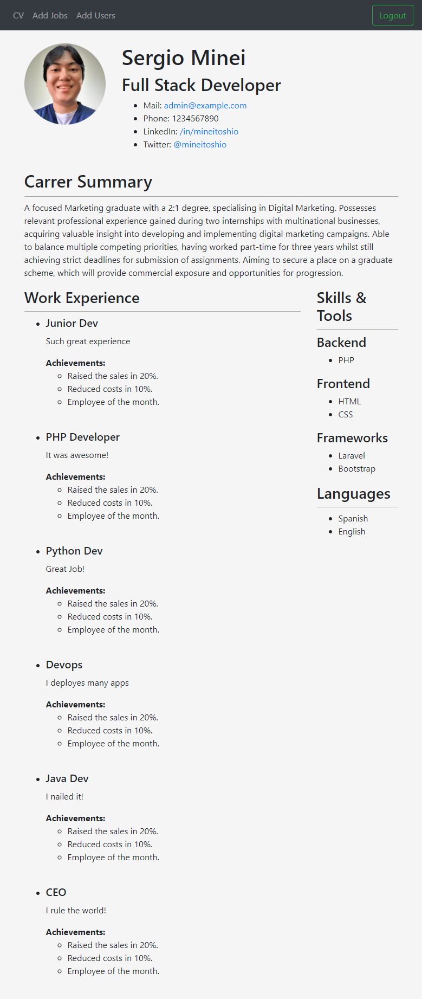

# PHP CV

A simple resume view made in PHP.

View the [live demo](https://phpcv.herokuapp.com).



## Getting Started

1. Run the database scripts in db/cursophp.sql.
2. Download the dependancies.
```bash
$ php composer.phar install
```
3. Change the environment variables in the **.env** file according to your database.